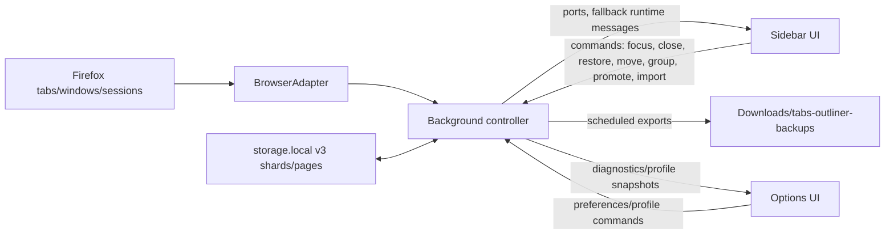
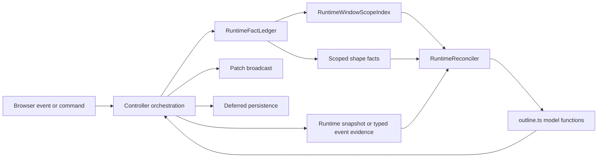

# Tab Session Outliner Architecture

Last updated: 2026-05-23

This document explains the current architecture and the main design decisions behind it. For performance history and measurements, see [PERFORMANCE_NOTES.md](./PERFORMANCE_NOTES.md).

## Product Shape

Tab Session Outliner is a Firefox Manifest V3 sidebar extension. Its job is to keep a durable outline of live tabs, live windows, recently closed tabs/windows, and user-created groups.

The extension has four surfaces:

- [background/index.ts](./src/background/index.ts) starts the background controller and owns browser-runtime synchronization, persistence, command handling, history, automatic backups, and broadcasts.
- [public/sidebar/sidebar.html](./public/sidebar/sidebar.html) loads [sidebar-boot.ts](./src/sidebar/sidebar-boot.ts) first, then the full [sidebar.ts](./src/sidebar/sidebar.ts) app. The sidebar renders and edits the outline.
- [public/options/options.html](./public/options/options.html) loads [options.ts](./src/options/options.ts) for shortcuts, undo-history settings, automatic-backup settings, performance-profile export, and opening the exported-tree viewer.
- [public/viewer/viewer.html](./public/viewer/viewer.html) loads [viewer.ts](./src/viewer/viewer.ts): a read-only viewer for an exported portable tree whose only node actions are expand/collapse and import-to-top-level (see [docs/exported-tree-viewer.md](./docs/exported-tree-viewer.md)).

The build is intentionally simple: TypeScript compiles `src/` to `dist/`, then [scripts/copy-static.mjs](./scripts/copy-static.mjs) copies `public/` into `dist/`.

## High-Level Flow

The background is the source of truth for the full outline. The sidebar keeps a local copy for rendering and applies port or fallback runtime broadcasts incrementally when possible.

## Core Data Model

The canonical model lives in [src/model/types.ts](./src/model/types.ts):

- `OutlineState` is `{ version, rootIds, nodes }`.
- `nodes` is a `Record<NodeId, OutlineNode>`.
- Tree order is represented by `rootIds` plus each node's `childIds`.
- Each node has a `kind`: `window`, `tab`, or `group`.
- Each node has a `status`: `live`, `closed`, or `neutral`.

The important distinction is between outline identity and browser runtime identity:

- `live` points to current Firefox runtime resources, such as `{ windowId }` or `{ tabId, windowId }`.
- `restore` stores enough data to restore a closed resource, usually a session id or URL fallback.
- `neutral` groups are user-created organizing nodes. They may contain live or closed descendants, but they do not represent a browser resource by themselves.

Most derived indexes are rebuilt rather than stored. [outline-lookup.ts](./src/model/outline-lookup.ts) derives maps from runtime ids to node ids, closed URL buckets, owner-window information, and summary counts. This keeps the persisted model small and avoids stale indexes.

## Model Operations

[outline.ts](./src/model/outline.ts) contains the tree operations and runtime reconciliation logic. The model layer mostly exposes pure functions that return the original state when nothing changed, or a new state when there is a real update.

Important operations include:

- `bootstrapFromWindows`: create an outline from the current normal, non-incognito Firefox windows.
- `reconcileWithWindows`: merge a Firefox runtime snapshot into the durable outline.
- `closeTab` / `closeWindow`: convert live nodes into closed/restorable nodes.
- `moveNode`, `wrapNodeInGroup`, `flattenSubtreeOneLevel`, `promoteChildrenOneLevel`, `renameGroup`, `deleteNode`: user structural edits.
- `planRestore` / `restoreNodes`: split restore planning from applying restored runtime ids.
- `projectLiveTabs`: compute browser tab order for a live window/subtree.

A recurring design choice is targeted copying. Small operations should clone only the node table and affected node records where practical, while preserving object identity for unchanged nodes. That identity is used later by history, patch building, and performance-sensitive sidebar updates.

[outliner-page.ts](./src/model/outliner-page.ts) provides reusable detection of the extension's own sidebar URLs. The sidebar uses it when choosing active-tab targets, and portable export applies equivalent filtering so outliner UI tabs are not treated like ordinary saved content.

## Background Controller

The background controller in [controller.ts](./src/background/controller.ts) is the architectural center of the extension. It coordinates browser events, user commands, persistence, history, performance tracing, and messages to sidebar instances.

### Initialization

The controller lazily initializes state through [state-cache.ts](./src/background/state-cache.ts). On first access it loads stored state and runtime windows in parallel:

- If stored state exists and materially matches Firefox, it is used without saving.
- If stored state needs repair or reconciliation, the controller repairs/reconciles it and schedules a save only when material state changed.
- If no stored state exists, it bootstraps from the current Firefox windows.

This keeps startup from doing unnecessary storage writes and avoids blocking first paint when the stored tree is already current.

### Commands

The sidebar sends typed commands from [commands.ts](./src/background/commands.ts): `focusNode`, `closeNode`, `restoreNode`, `deleteNode`, `moveNode`, `moveNodeToNewWindow`, `wrapNodeInGroup`, `flattenSubtree`, `promoteChildren`, `toggleCollapsed`, `expandAncestors`, `renameGroup`, `importTree`, `undo`, `redo`, and read-only requests. The exported-tree viewer sends `importSubtreeToTopLevel` (append a selected portable subtree as new top-level node(s)). It also sends `openSidebarWindow`, and the options page `openImportViewerWindow`, as controller requests outside the main command union.

`runCommand` handles the browser side effects and model update for each command. The controller wraps it with:

- command transaction recording in the runtime fact ledger, so command-owned Firefox events have explicit provenance;
- runtime-index maintenance, so narrow command/event transitions keep indexed lookup state warm;
- history recording for structural commands;
- patch selection and broadcast;
- deferred persistence.

Mutating commands return `commandAck` instead of a full state. The visible update arrives through a broadcast. This avoids the old pattern where the initiating sidebar rendered once from the command response and again from the broadcast. Current sidebar broadcasts prefer a long-lived `tabs-outliner-sidebar` runtime port and fall back to fire-and-forget `runtime.sendMessage`, so command acknowledgements do not wait for Firefox to resolve slow broadcast promises.

### Runtime Events

The controller listens to Firefox `tabs`, `windows`, and `sessions` events. Runtime updates are treated as data that may or may not matter:

- Browser events are first recorded as typed runtime observations.
- Empty/status-only tab updates are ignored.
- No-op runtime updates are filtered before reconciliation.
- Command-owned focus, close, delete, restore, and relocated-tab echoes are absorbed when safe.
- Runtime event bursts are coalesced before reconciliation.
- Browser-created tab/window events try narrow indexed fast paths before falling back to full runtime reconciliation.

The controller keeps a `RuntimeStateIndex` for live tabs/windows, active nodes, per-window live-tab sets, and closed-restore candidate counts. Normal command/native state transitions use candidate node ids to update the index in place, rather than leaving the next echo to rebuild the index from all nodes. Fast paths update only known affected nodes and return the exact compact patch they need to broadcast.

### Automatic Backups

Automatic backups are implemented in [backups.ts](./src/background/backups.ts). When enabled in preferences, the controller schedules a daily `alarms` job, waits for the mutation scheduler to go idle, exports the portable tree format, downloads it to `Downloads/tabs-outliner-backups`, and records backup status in `storage.local`.

The backup path uses the same portable export as manual sidebar export, but it is background-owned because it needs extension lifecycle hooks, alarms, downloads, and persisted status.

### Scheduler

Background mutations run through a small priority scheduler:

- User commands, undo/redo, removals, session cleanup, and command-owned focus echoes are high priority.
- Browser-created runtime refreshes are low priority and are merged into a pending accumulator.

This prevents stale runtime-refresh work from sitting in front of user-visible actions. In-flight work is not preempted; later runtime events become one trailing low-priority refresh.

## Runtime Reconciliation

Runtime/model convergence is now handled through an internal fact ledger and reconciler under [src/background](./src/background). This is an incremental strangler around the older controller logic: browser/sidebar contracts, storage schema, model functions, and visible behavior stay unchanged, while command ownership and stale runtime evidence are represented as typed facts instead of scattered controller-local sets.

### Runtime Fact Ledger

[runtime-facts.ts](./src/background/runtime-facts.ts) owns ephemeral runtime facts for the current background lifetime:

- typed observations from tab, window, session, snapshot, and command sources;
- command transactions with planned tabs/windows, expected echoes, ownership, and commit/reject lifecycle;
- command-owned close/delete guards;
- tab/window removal tombstones;
- restored-tab, focus, grouped-tab, and relocated-tab echo protection.
- runtime-window scopes and scoped shape facts that separate ownership from freshness.

The ledger is not persisted. On background startup, the durable outline and current browser runtime are loaded again, then reconciliation rebuilds the live truth from those sources. The bounded observation history exists for debugging and deterministic trace failures, not as storage state.

There is one deliberately tiny durability exception: [runtime-lifecycle-journal.ts](./src/background/runtime-lifecycle-journal.ts) stores bounded, versioned recovery hints for in-flight user-visible lifecycle commands. It is not a persisted ledger. It records only intent needed to recover `close`, `delete`, `restore`, relocation, and history replay if the background dies after browser side effects but before outline/history persistence. Startup consumes the journal once against a complete `windows.getAll({ populate: true })` snapshot, applies recovery only when runtime evidence confirms the side effect, then clears the entries.

Command handlers begin a ledger transaction before issuing browser-adapter calls. If the browser reports side effects before a command resolves, the controller records those observed facts and later commits or rejects the transaction. Recovery paths use the command plan plus current runtime facts so a rejected command does not resurrect resources that the browser already moved or removed.

### Runtime Window Scopes

[runtime-window-scope.ts](./src/background/runtime-window-scope.ts) is the ownership index for browser windows. Browser listeners remain global, but observations are routed through a scope keyed by `runtimeWindowId` before they are allowed to mutate outline state.

Each scope records:

- the owning outline window node when one exists;
- live tab node ids by runtime tab id;
- current tab order, active tab, and window state when known;
- provenance: `saved`, `restored`, `browserCreated`, or `commandCreated`;
- lifecycle: `live`, `closing`, or `removed`.

Scopes are ephemeral and reconstructable. Startup and installed state transitions rebuild them from durable outline nodes plus complete runtime snapshots. Unknown runtime windows from a complete snapshot become `browserCreated` candidates; command-created windows are tracked by command provenance; restored windows keep ownership of their original outline node even when the runtime ids changed.

This is intentionally not a per-group browser subscription model. The browser event stream is still one global stream. The scope index answers "which outline owner does this runtime window currently belong to?" and "what provenance/lifecycle policy applies here?" before the reconciler decides whether an event is close, delete, stale echo, metadata update, or shape refresh.

### Runtime Shape Facts

Ownership is not enough. A tab event can route to the correct scope and still carry stale shape. The ledger therefore stores scoped shape facts for tabs and windows:

- `RuntimeTabShapeFact`: runtime tab id, window id, optional index/active/title/url/favicon, source, confidence, scope generation, and observation sequence.
- `RuntimeWindowShapeFact`: runtime window id, tab order, optional active tab/focus/window state, source, confidence, scope generation, and observation sequence.

`tabs.onUpdated` evidence is field-masked from `changeInfo`; it may update title/url/favicon when those fields are present, but it does not smuggle stale `active` or `index` values from the event tab payload. `tabs.onActivated` is authoritative for active state. `tabs.onMoved` and `tabs.onAttached` are authoritative for location/order only after destination-window evidence is fetched. `tabs.onCreated` for a known tab is treated as a stale echo unless a current snapshot corroborates it.

Dominance is explicit: complete snapshots dominate event-local facts; newer same-scope facts dominate older payloads; newer scope generations dominate stale event evidence from an old ownership/order shape. Conflicting event-local facts trigger corroboration with a complete or current-window snapshot instead of directly rewriting the outline. The common metadata fast path remains cheap when the event is non-conflicting and field-local.

### Runtime Reconciler

[runtime-reconciler.ts](./src/background/runtime-reconciler.ts) is the normalization gate before broad calls to `reconcileWithWindows`. It combines the current `OutlineState`, warm runtime index, ledger facts, and runtime observations into the snapshot that the model layer should see.

Snapshot confidence is explicit:

- `complete`: a broad runtime snapshot that can prove absence.
- `partial`: an intentionally incomplete query result.
- `eventLocal`: evidence near one browser event.
- `staleSuspect`: evidence known to be vulnerable to old-window or delayed-echo races.

The current reconciler keeps the following rules centralized:

- Partial snapshots do not delete live resources unless the ledger already knows the resource was removed or command-deleted.
- Removed tab/window tombstones filter refresh snapshots until a later live state legitimately reintroduces the resource.
- Stale old-window echoes for command-relocated tabs are denied while the tab still belongs to the command-created destination window.
- Fresh current-window tab events may update metadata without clearing old-window stale protection, but only through field-level shape facts.
- Empty runtime windows are not treated as valid live browser windows.
- Native close classification is based on event shape plus ledger state: `windows.onRemoved` means a window close, while lone `tabs.onRemoved` means a tab deletion unless a matching window close is in flight.
- `sessions.onChanged` and complete refresh evidence can classify a missing whole window when no `windows.onRemoved` event arrived, using reconstructed scope provenance to preserve browser-created/restored/saved windows as closed.
- Browser-authored tab moves are structural runtime changes, not stale echoes, when current evidence proves a known tab moved to another runtime window.
- History replay may change outline structure, but complete current runtime shape wins for surviving live resources unless the replay intentionally deletes, closes, or restores that resource.

The controller still owns orchestration: command dispatch, adapter calls, scheduling, history, patch selection, persistence, and sidebar broadcasts. The intended direction is that more event meaning and command side-effect recovery moves behind the ledger/reconciler boundary, leaving the controller as plumbing rather than the place where runtime truth is inferred.

Current event handlers record native facts through the ledger and receive domain decisions such as "ignore command-owned tab removal," "handle command focus," "close this runtime window," or "corroborate this shape before applying it." Event-local tab filtering, missing-live-tab detection, restored/browser-created scope classification, stale-relocation echo filtering, and shape freshness checks live in the ledger/reconciler path. The remaining controller branches are mostly the effects around those decisions: reading browser snapshots, applying model operations, updating the warm runtime index, recording history, selecting patches, saving, and broadcasting.

## Message And Patch Contract

The background sends several update shapes:

- `stateUpdated`: full-state fallback, reserved for compatibility or genuinely broad changes.
- `nodeStateUpdated`: metadata/status/active/collapsed/title changes where tree structure did not change.
- `treeStructureUpdated`: inserts, deletes, moves, and parent/child/root changes.
- `activeStateUpdated`: volatile active-window/tab changes, especially command-owned focus echoes.
- `historyStatus`: undo/redo availability.

Sidebars receive these messages through a connected runtime port when available. The fallback `runtime.sendMessage` path is intentionally nonblocking, because Firefox can keep those promises open for seconds even after the sidebar visibly applies the patch. Profile-control pings use the same nonblocking delivery so profiling does not distort the trace it is managing.

Patch builders can use two diff modes:

- `identity` mode is cheap when model operations preserve object identity for unchanged nodes.
- `material` mode compares fields and is used after runtime reconciliation, because `reconcileWithWindows` may clone more than the semantically changed nodes.

The full-state broadcast remains an intentional fallback. Compact patches are preferred, but only when they are smaller than the full tree and can preserve visible behavior.

## Persistence

Persistence is split into two durable artifacts (the v4 design, 2026-06; see
`docs/storage-rearchitecture/` for the full rationale):

- **Mutation journal** ([outline-journal.ts](./src/background/outline-journal.ts)): an
  append-only ring of 64 slots (`outline:v4:journal:slot:<i>` plus `outline:v4:journal:meta`)
  holding `{seq, epoch, kind, delta}` entries whose deltas are absolute
  `{rootIds?, updatedNodes, deletedNodeIds}` records. Replay is a pure overwrite in seq
  order. Small command deltas are appended **before the command ack** (invariant I-1: an
  acked mutation survives a background restart); runtime-event deltas are coalesced on a
  50 ms quiet / 250 ms max timer (Class B: at most 250 ms of event bookkeeping is lost on
  process death). Deltas too heavy to journal cheaply (node count plus total `childIds`
  over 2,000 — e.g. any edit touching a 50k-child window) skip the journal and rely on the
  deferred snapshot save, which is the same loss window the pre-journal design accepted.
- **Snapshot store** ([storage-v4.ts](./src/background/storage-v4.ts)): 32 hash shards of
  full node records with `childIds` inline (`outline:v4:nodes:<idx>:<generation>`) plus
  double-buffered manifests (`outline:v4:manifest:a|b`). Shard keys are copy-on-write: a
  compaction writes dirty shards at `generation + 1` and the inactive manifest slot in one
  `storage.local.set`, then garbage-collects superseded keys. A shard is only trusted when
  its embedded generation matches the manifest's `shardGenerations` entry, so consistency
  is verifiable from storage alone and a torn write can never be half-trusted.

The save scheduler is unchanged in shape (deferred quiet/max delays, interaction commands
use the longer schedule, one in-flight flush at a time), but a flush is now a **compaction**:
dirty shards = the pending save's candidate shards ∪ shards touched by journal appends since
the last stamped compaction; a save without candidates (broad edits, startup rewrites,
failure retries) rewrites all 32. The manifest records `journalSeqIncluded`; entries at or
below it are pruned after the flush, and queued-but-unappended event deltas subsumed by the
snapshot are dropped.

Loading ([controller startup](./src/background/controller.ts) + `loadStateV4`) follows an
explicit recovery ladder — no fallback is silent:

- R0: the highest-generation valid manifest with every shard generation verified.
- R1: that snapshot is torn → the other manifest slot (its keys are untouched by
  construction); its older `journalSeqIncluded` makes replay cover the entries the torn
  compaction failed to fold in.
- R2: both manifests unusable → salvage every readable shard at its highest readable
  generation, run structural repair, replay the whole journal.
- R3: no v4 keys → one-time migration from the legacy v3 store (including the v3 salvage
  ladder), with read-back verification, a portable-tree backup under
  `outline:v4:migrationBackup`, and legacy-key deletion only after the migrated store
  verifies; failures keep legacy keys authoritative and retry next startup. v1/v2 stores
  are no longer readable: their keys are detected (and eventually cleaned up after a
  successful migration), but startup bootstraps instead of interpreting them and records
  `bootstrapSkippedStoredDataPresent`.
- R4: nothing stored at all → bootstrap from the open windows (genuinely first run).

Every non-R0 outcome records an incident (`v4LoadRecovery`, `v3LoadSalvaged`,
`v4MigrationFailed`, `journalReplay`) visible on the options page.

The boot snapshot (256-row sparse first paint) lives at `outline:v4:bootSnapshot`, written
on a 10 s debounce off the interaction path — never inside a save flush. Runtime lifecycle
commands additionally persist a small intent journal (`runtimeLifecycleJournal:v1`) before
touching browser tabs/windows, so startup can repair confirmed side effects before normal
reconciliation; it predates and currently complements the outline journal.

## Sidebar Rendering

The sidebar is optimized around three stages:

1. [sidebar-boot.ts](./src/sidebar/sidebar-boot.ts) requests `getInitialTreeSnapshot`, paints rows directly when the snapshot is safe to reveal, marks first rows, and then imports the full sidebar app.
2. [sidebar.ts](./src/sidebar/sidebar.ts) connects a background port, adopts the boot snapshot, disables hydration-sensitive controls, and schedules full `getState` hydration after a short delay.
3. After hydration, the sidebar owns a full local `OutlineState` copy and responds to compact broadcasts.

The sparse first-paint contract is deliberately narrower than full feature readiness. The sidebar may render and scroll sparse rows before hydration, but export, search, import, drag/drop, and most mutating row actions stay disabled until the local state has the complete node table. This avoids exporting or mutating a sidebar-local partial tree while keeping first paint independent of full hydration.

The sidebar does not render the full DOM for large trees. [visible-tree.ts](./src/sidebar/visible-tree.ts) builds a `VisibleTreeProjection`, and the sidebar renders a virtual range with overscan. Search uses the same projection structure but reveals matching descendants and their ancestor paths, including inside collapsed groups.

Search result rows can offer "Show in tree"; this sends `expandAncestors`, clears search, and briefly highlights the revealed row. The sidebar also exposes `promoteChildren` for one-level child promotion and an `openSidebarWindow` toolbar action for a full-size popup sidebar. The background ignores focus noise from extension-owned full-size sidebar windows so they do not trigger outline reconciliation.

Patch handling mirrors the background patch contract:

- `activeStateUpdated` updates active flags and schedules virtual rows.
- `nodeStateUpdated` updates node records and reuses the current projection when search/collapse state allows it.
- `treeStructureUpdated` tries same-parent reorder, pure insert, and delete projection fast paths before falling back to a full projection rebuild.

Patch paths must preserve side effects that used to happen in `render()`: counters, empty state, active-tab scrolling, rename cleanup, cut/drop state, and diagnostics scheduling. [active-scroll.ts](./src/sidebar/active-scroll.ts) exists because active-tab auto-scroll needs to work for both full renders and compact patches.

## History

Undo/redo history lives in [history.ts](./src/background/history.ts). It records compact `OutlineDelta` entries instead of full snapshots:

- `rootIds`
- updated node records
- deleted node ids

History is recorded for structural/user edits such as move, group, flatten, promote, expand ancestors, rename, import, and delete. Applying undo/redo can require browser side effects, so the controller materializes or closes live runtime resources and then syncs browser tab order when live structure changes.

The history limit is user-configurable through preferences and is persisted alongside outline state. Structural history playback uses the interaction save schedule, matching the original command's expected burst behavior.

## Preferences And Options

[preferences.ts](./src/preferences.ts) owns normalized app preferences:

- undo history limit;
- automatic backup enablement;
- sidebar shortcut enablement and key combos;
- validation for duplicate shortcuts.

The options page edits those preferences, shows automatic-backup status, manages the Firefox native sidebar shortcut, and controls performance profiling. Preferences are stored in `storage.local`; the sidebar and background listen for preference changes where they need live updates.

## Diagnostics And Profiling

Diagnostics are intentionally advisory. [diagnostics.ts](./src/background/diagnostics.ts) compares runtime tab ids with outline live-tab nodes and reports summary counts. The sidebar coalesces diagnostics requests so they do not multiply background work after every patch.

Performance tracing is opt-in and shared by background and sidebar:

- [perf/trace.ts](./src/perf/trace.ts) records bounded mark/measure entries.
- [perf/profile.ts](./src/perf/profile.ts) combines background and sidebar traces and exports JSON.
- `window.tabsOutlinerProfile` in the sidebar exposes `enable`, `disable`, `clear`, `snapshot`, and `summary`.
- The options page can start, stop, reset, and export a profile.

The performance notes favor real extension traces when synthetic Node profiles disagree with manual QA.

The synthetic profile scripts share [scripts/profile-harness.mjs](./scripts/profile-harness.mjs), which now counts Firefox-like event echoes (`tabs.onUpdated`, `tabs.onActivated`, `windows.onFocusChanged`, and the rest). This keeps command profiles honest about event traffic instead of only measuring direct adapter calls.

## Testing Strategy

There are two main test layers:

- Vitest unit/controller/model tests under `src/**/*.test.ts`.
- Playwright tests under [tests/playwright](./tests/playwright), served from built `dist/`.

Model and controller tests cover pure tree behavior, command behavior, runtime interleavings, storage, history, and patch contracts. Playwright tests drive the actual sidebar HTML for first paint, drag/drop, active scroll, cut/paste, undo/redo, options, and layout-sensitive behavior.

Generated trace tests exercise random/interleaved operation sequences and assert invariants such as runtime-index warmth. `pnpm test:soak` runs a seeded generated-trace soak via [scripts/run-generated-soak.mjs](./scripts/run-generated-soak.mjs).

Runtime domain traces cover deterministic browser/controller interleavings. Known bug repros are regression traces that run in ordinary `pnpm test`; lower-priming discovery traces are selected by `pnpm trace-hunt:runtime`. The current corpus has 106 regression traces and 78 discovery traces. [RUNTIME_TRACE_HUNT_GUIDE.md](./RUNTIME_TRACE_HUNT_GUIDE.md) defines the adversarial discovery process and coverage matrix, while [RUNTIME_TRACE_BUGS.md](./RUNTIME_TRACE_BUGS.md) is the evidence and dedupe log.

The repository also has repeatable profile scripts:

- `pnpm profile:tab-open`
- `pnpm profile:close`
- `pnpm profile:delete`
- `pnpm profile:focus`
- `pnpm profile:restore`
- `pnpm profile:diagnostics`
- `pnpm profile:command`
- `pnpm test:soak`

For performance work, record the scenario, tree size, command, before/after numbers, and whether the measurement was synthetic or in-browser.

## Key Design Decisions

### Durable Outline First

The core product promise is not "mirror the browser exactly." It is "keep a useful durable outline." Closed nodes remain in the outline, neutral groups can organize live and closed content, and runtime reconciliation tries to preserve user structure where possible.

### Background Owns Truth, Sidebar Owns Projection

The background owns the full state because it is the only surface that consistently sees browser events and can coordinate persistence. The sidebar owns projection and rendering because projection depends on search, scroll, hydration state, rename/cut/drop state, and DOM concerns.

### Prefer Compact Semantic Updates

Full-state transport is expensive with 50k to 100k nodes. Small visible changes should use semantic patches, not `stateUpdated`. This affects controller design, model identity preservation, sidebar patch handlers, and tests.

### Do Not Await Sidebar Broadcasts

Sidebar broadcasts are UI invalidations, not the mutation's durable completion point. They use ports or fire-and-forget fallback messages so repeated commands do not queue behind slow `runtime.sendMessage()` promise resolution in Firefox.

### Separate Perceived Latency From Durability

User-visible updates are broadcast first. Full persistence is deferred and coalesced. Structural bursts get a longer interaction save schedule, while ordinary saves keep a shorter schedule. This creates a brief window where the latest outline-only edits can be lost if the extension process dies before saving. Commands that can change browser lifecycle state first write the recovery journal, so browser-side close/delete/restore/relocation/history effects are either durably reflected on restart or ignored when a complete runtime snapshot does not confirm them.

### Make Runtime Provenance Explicit

A command can be fast and still feel slow if the browser echoes it with stale or redundant events. Command ownership, browser-event provenance, tombstones, snapshot confidence, and stale-echo protection are explicit ledger/reconciler data so the next event does not trigger an unnecessary snapshot, save, or broadcast.

### Separate Ownership From Freshness

Runtime-window scopes decide which outline owner and lifecycle policy apply to a browser observation. Shape facts decide whether the observation is fresh enough, field-specific enough, and authoritative enough to update browser shape in the outline. Keeping those concepts separate prevents a correctly routed stale event from regressing tab order, active state, metadata, or window ownership.

### Let Current Runtime Shape Survive History Replay

Undo/redo replays Tabs Outliner structure, not a stale browser universe. Before history replay can synchronize browser resources, the controller captures current complete runtime shape; after applying the outline delta, surviving live tabs/windows are overlaid with current runtime ownership, active state, metadata, and provenance. Delete/close/restore replay remains strict, but unrelated browser-created or browser-moved resources are preserved.

### Keep Runtime Indexes Warm

The runtime index is now a first-class performance structure, not just a convenience cache. Narrow command/native transitions update the existing index from candidate node ids, and generated traces assert that the warm index matches a rebuilt reference after operations. This keeps common echo filtering and focus updates off whole-node-table scans.

### Keep Fallbacks

Fast paths are guarded. If a patch would be ambiguous, whole-tree sized, search-sensitive, hidden by collapse, stale, or structurally unsafe, the code falls back to full reconciliation or full projection rebuild. The optimization boundary is intentionally conservative.

## Important Invariants

The numbered registry with owner mechanisms and enforcing tests lives in
[INVARIANTS.md](./INVARIANTS.md); cite `I-n` ids from hunts, guards, and fix entries.

- Every reachable child id should exist in `state.nodes`.
- Parent and child links should agree for normal tree operations.
- `rootIds` order and each `childIds` order define visible outline order.
- Live tab/window refs should map to current Firefox runtime resources after reconciliation.
- Closed nodes should keep enough `restore` data to restore by session id or URL fallback.
- Runtime-window scopes should be reconstructable from durable outline state plus a complete runtime snapshot.
- Event-local tab payloads should not overwrite unrelated shape fields; field masks and shape fact dominance decide what can change.
- The cached `RuntimeStateIndex` should remain warm and match the installed state after narrow command/native transitions.
- Compact patch application must leave sidebar state equivalent to the next full state for the changed surface.
- `getState` waits for pending background mutations so callers do not hydrate stale state.
- Search, export, import, drag/drop, and mutating row actions are gated while the sidebar only has a sparse initial snapshot.
- Sidebar broadcasts should not be awaited by command acknowledgements.

## Adding Or Changing Features

Most behavior changes should move through these layers:

1. Add or update model behavior in `src/model`, with unit tests.
2. Add or update a command in `src/background/commands.ts` if the sidebar needs a new action.
3. Route the command in `src/background/controller.ts`, including history, runtime-index candidate ids, runtime echo handling, patch choice, and persistence schedule.
4. Update the sidebar command call and patch/render behavior.
5. Add Playwright coverage for browser-visible behavior when the feature affects the UI.
6. For performance-sensitive paths, profile the realistic scenario and update [PERFORMANCE_NOTES.md](./PERFORMANCE_NOTES.md).

## Current Tradeoffs And Follow-Ups

- v4 loads are 2 storage round trips (manifests + meta, then 32 shards + journal slots), eliminating the v3 order-page fanout that dominated real-Firefox hydration. Remaining storage gaps: heavy deltas (over the journal weight cap) keep the deferred-save loss window until spill markers land, runtime-event journaling accepts a ≤250 ms window by design, and a single 50k-child window concentrates ~1 MB of `childIds` in one shard per touch. The v3 incremental writer and the `lastPersistedState` baseline machinery still exist pending the post-soak deletion phase (`docs/storage-rearchitecture/02-IMPLEMENTATION-PLAN.md` Phase 4).
- Large structural operations such as flattening a huge window can still produce large history and structure deltas.
- Runtime fast paths cover common tab/window create/update flows, but full reconciliation remains necessary for ambiguous or restore-candidate cases.
- The runtime fact ledger/reconciler/scope path has absorbed command ownership, native event classification, stale-evidence filtering, missing-live-tab detection, scope provenance, and shape freshness. The controller still intentionally owns orchestration-specific branches for adapter calls, history, patching, persistence, and broadcasts.
- Opener-created runtime tab placement still walks ancestors to validate ownership; an owner-window index would make that path closer to `O(u + k)`.
- The scheduler lets high-priority commands overtake queued low-priority runtime refreshes, but it does not interrupt work already in flight.
- Sidebar projection fast paths are intentionally narrow. Search-active, active-row side effects, and non-local structural patches still need stronger projection indexes before they can avoid broader row scans or full projection rebuilds.
- Undo/redo for broad history deltas still rebuilds the runtime index intentionally; narrow history deltas could eventually thread candidate ids through `installStateTransition()`.
